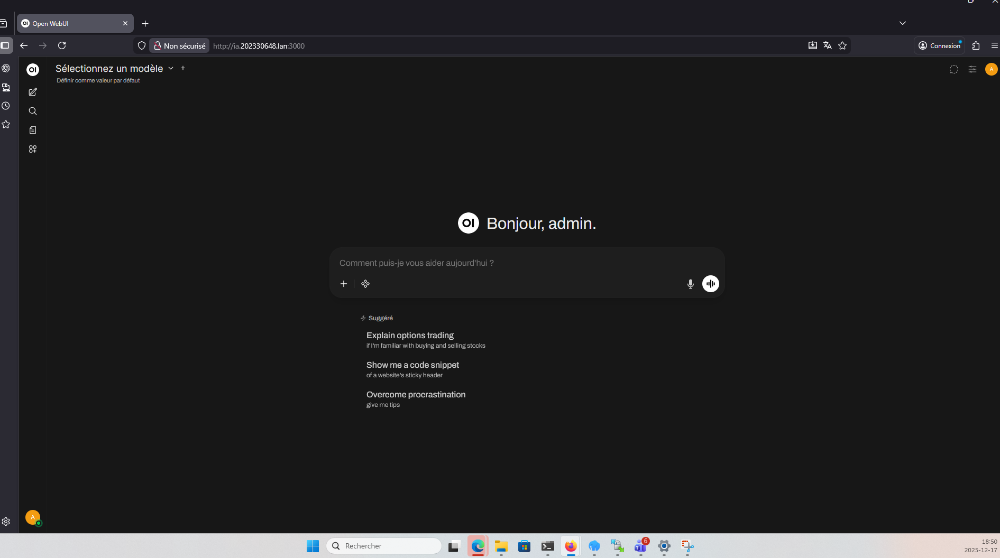
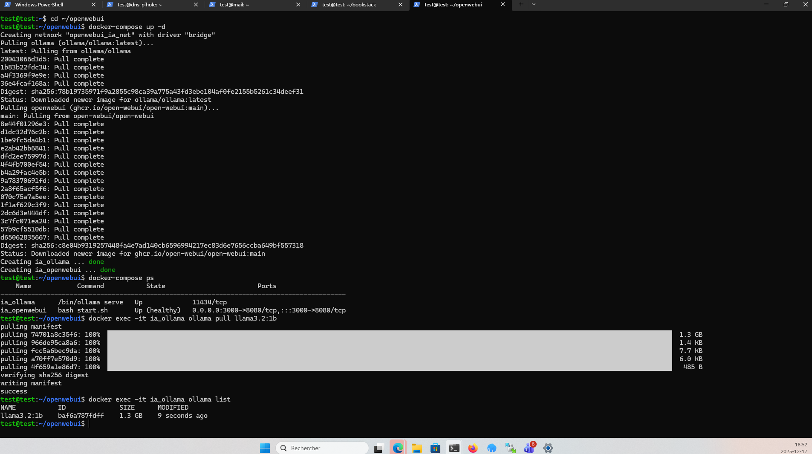

# Interface OpenWebUI

## Accès
URL : http://ia.202330648.lan:3000

## Fonctionnement
L’interface est accessible et permet de sélectionner un modèle IA.

## Interface
- Page chargée correctement
- Connexion admin réussie

## Modèle
Modèle sélectionné : llama3.2:1b

# Configuration et tests du serveur IA – OpenWebUI

## 1. Présentation du serveur IA

- **Nom du serveur** : ia
- **Adresse IP** : 192.168.16.13
- **Port d’accès** : 3000
- **Application IA** : OpenWebUI
- **Déploiement** : Docker / Docker Compose
- **Modèle utilisé** : llama3.2:1b
- **Accès Web** : http://192.168.16.13:3000

---

## 2. Accès à l’interface OpenWebUI

L’interface OpenWebUI est accessible depuis un navigateur Web à l’adresse suivante :

```cpp
http://192.168.16.13:3000
```

L’accès affiche la page d’accueil invitant l’utilisateur à démarrer l’application.

### Capture – Page d’accueil OpenWebUI


---

## 3. Création du compte administrateur

Ce compte permet d’administrer l’instance OpenWebUI et d’accéder aux paramètres.

## 4. Installation et confirmation du modèle IA

Le modèle **llama3.2:1b** a été téléchargé et configuré via OpenWebUI.

Une confirmation visuelle indique que le modèle est bien installé et prêt à l’utilisation.

### Capture – Confirmation installation du modèle


---

## 5. Test de fonctionnement de l’IA

Un test a été effectué en envoyant un prompt directement dans l’interface OpenWebUI.

### Exemple de prompt envoyé : Bonjour, as-tu un nom ?

L’IA a répondu correctement, confirmant :
- le bon fonctionnement du modèle,
- la communication entre OpenWebUI et le moteur IA,
- la capacité de génération de réponses en temps réel.

### Capture – Test de fonctionnement


---

## 6. Validation du fonctionnement global

Les éléments suivants ont été validés avec succès :

- Accès Web fonctionnel à OpenWebUI
- Création d’un utilisateur administrateur
- Installation et chargement du modèle LLaMA
- Envoi de prompts
- Réception de réponses de l’IA

---

## Conclusion

Le serveur **ServeurIA_OpenWebUI** est pleinement fonctionnel.  
L’instance OpenWebUI permet :

- l’administration des utilisateurs,
- la gestion des modèles IA,
- l’interaction directe avec un modèle de langage,
- l’utilisation locale sans dépendance à un service externe.

Les tests réalisés confirment que le serveur répond correctement aux demandes et satisfait les exigences du projet.
