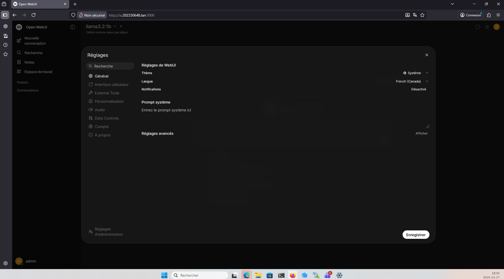

# Administration OpenWebUI

## Accès administrateur
Le panneau d’administration d’OpenWebUI est accessible uniquement après authentification
avec un compte administrateur.

### URL d’accès :

```cpp
http://192.168.16.13:3000/admin/settings
```

Ce panneau permet de gérer :
- les paramètres globaux,
- les utilisateurs,
- les modèles IA,
- les fonctionnalités avancées.

---

## 2. Section « Modèles »

Dans le menu **Réglages → Modèles**, l’administrateur peut :
- voir les modèles installés,
- activer ou désactiver un modèle,
- vérifier l’identifiant et la version du modèle,
- exporter ou importer des préréglages.

### Capture – Liste des modèles installés

## Paramètres
- Gestion des modèles
- Paramètres généraux disponibles


## Conclusion
L’administration du service est fonctionnelle.
