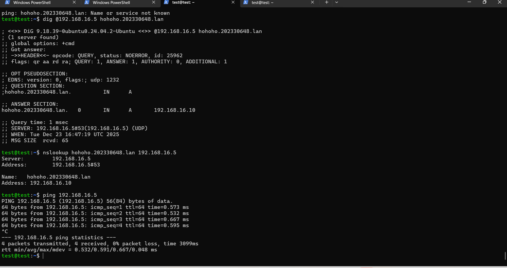
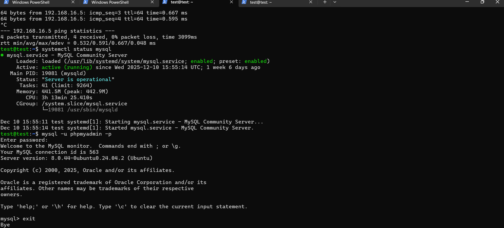

# Tests du serveur Web LAMP

## Test Apache
- Accès à http://192.168.16.10
- Page Apache par défaut affichée avec succès

## Test PHP
Création d’un fichier test.php contenant la fonction phpinfo().
Résultat : affichage correct des informations PHP dans le navigateur.

## Test MySQL
Connexion réussie à la base de données hohoho_202330648 avec l’utilisateur hohoho_202330648.
mot de passe : test
## Test WordPress
Accès réussi au site via l’adresse :
http://hohoho.202330648.lan

La page WordPress s’affiche correctement.

### Résultat obtenu

